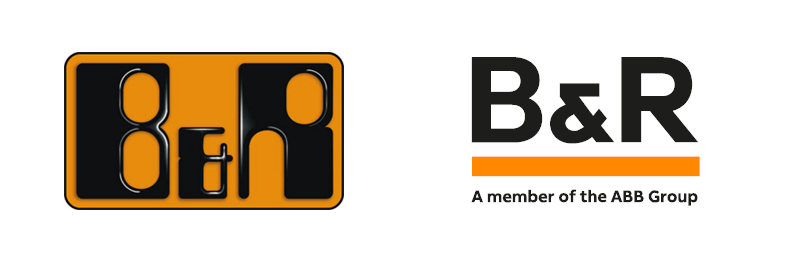

# Automatic bottle filling-capping system using PLC
# Made with

    

## Table of contents
- [Controller and addons](#controler-and-addons)
- [src](#src)
- [Model](#model)

## Introduction
The automatic bottle filling system was created using B&R technology and model I have build myself. The goal was to create mockup symulating real production line on a smaller scale.

### Controller and addons
The project was made using B&R components listed below.
|Component             | Description          |
|----------------------|----------------------|
|X20 CP 3586           |Main controller       |
|X20 DI9371            |Digital Input         |
|X20 DO9322            |Digital Output        |
|X20 AI4632            |Analog Input          |
|X20 AO4632            |Analog Output         |
|X20 DC1196            |EnDat interface       |
|X20 PS4951            |Potentiometers Input  |
|X20 MM4456            |PWM generator         |
|X20 BT9100            |Modbus communication  |
|80PS080X3.10-01       |PSU                   |
|ACOPOSmicro 100D Servo|Servo controller      |

### Src
Everything in `src/code.txt` was written in [Automation Studio](https://www.br-automation.com/pl/uslugi/rejestracja-oprogramowania/)
The code is based on state machine:
- State 0: **Engine tuning  and setting errors**
- State 1: **Powering engines**
- State 2: **Engine homing**
- State 3: **Main engine movement / collecting bottles**
- State 4: **Bottle water pouring / valve opening**
- State 5: **Main engine movement 90 degrees**
- State 6: **Bottle water pouring / valve opening / tightening the caps**
- State 7: **Main engine movement**
More info in `src/code.txt`

### Model

Whole model with control station.

    

Model upview.

    

